  

 

  i build where low-level systems meet applied intelligence: rust daemons, kernel modules, ml pipelines.

 

## ▍ building

  
  

## ▍ stack

## ▍ activity

<picture>
  <source media="(prefers-color-scheme: dark)" srcset="https://raw.githubusercontent.com/overspend1/overspend1/output/snake-dark.svg"/>
  
</picture>

 

artwork generated by <a href="./scripts/gen_assets.py"><code>scripts/gen_assets.py</code></a>

